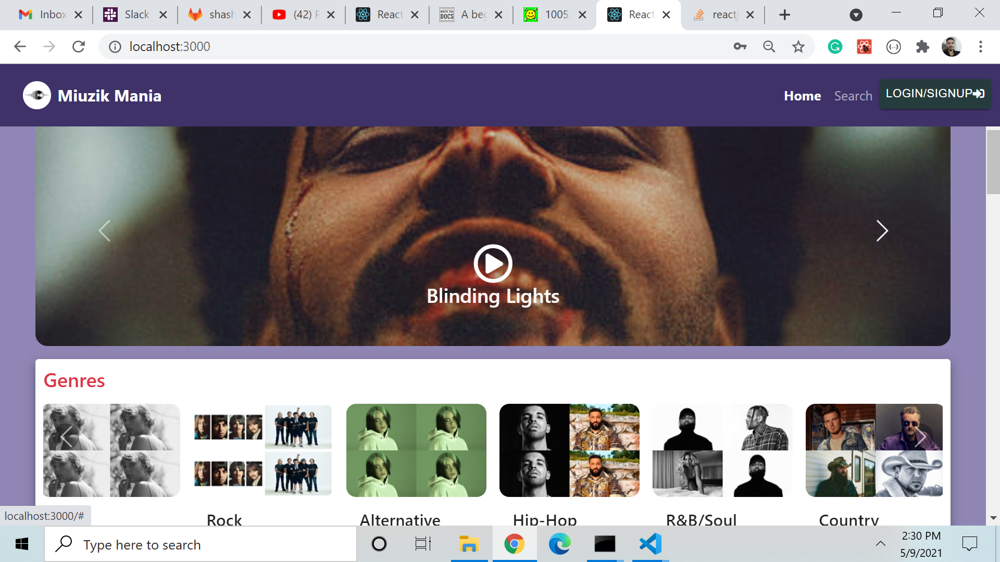
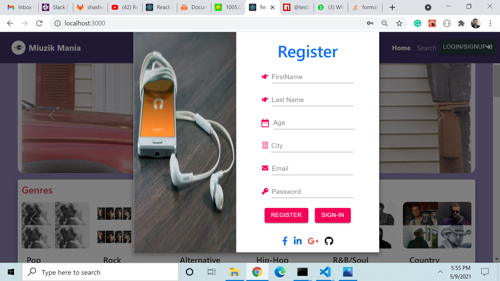
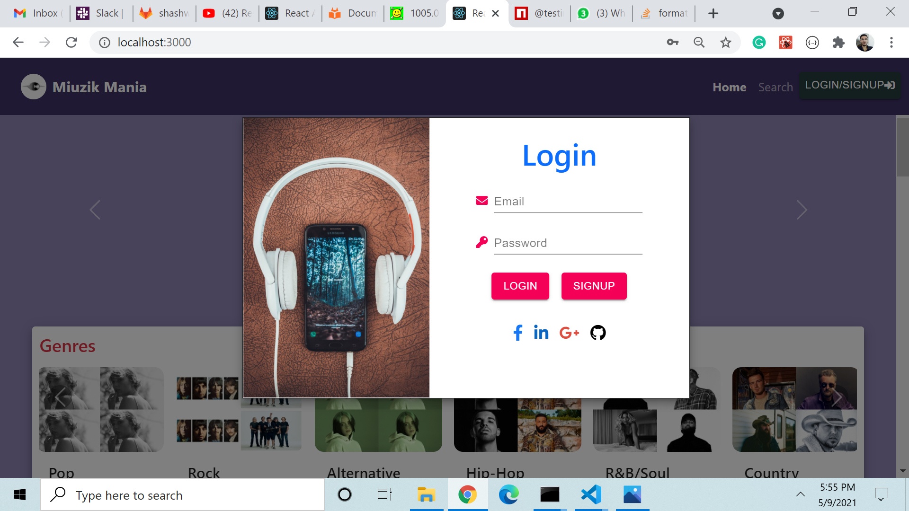
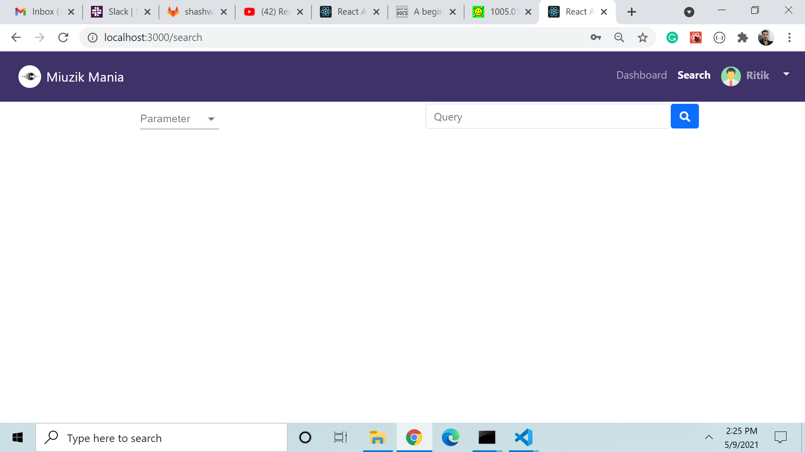
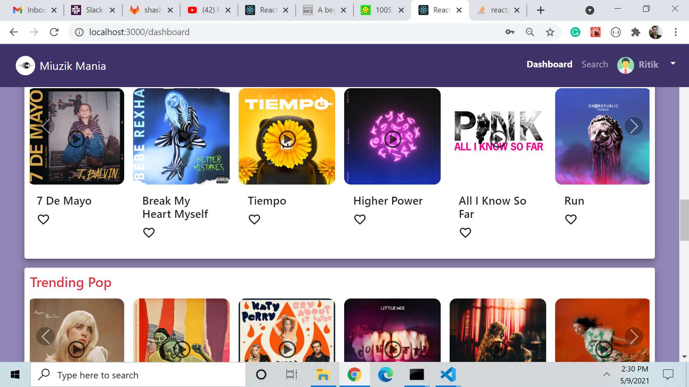
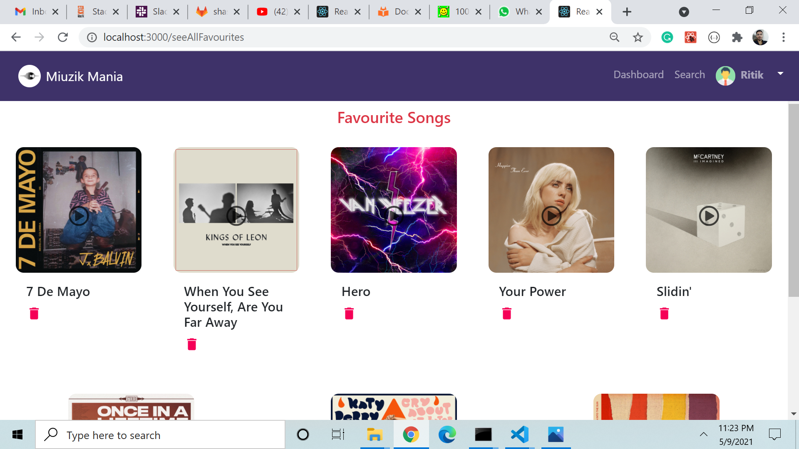
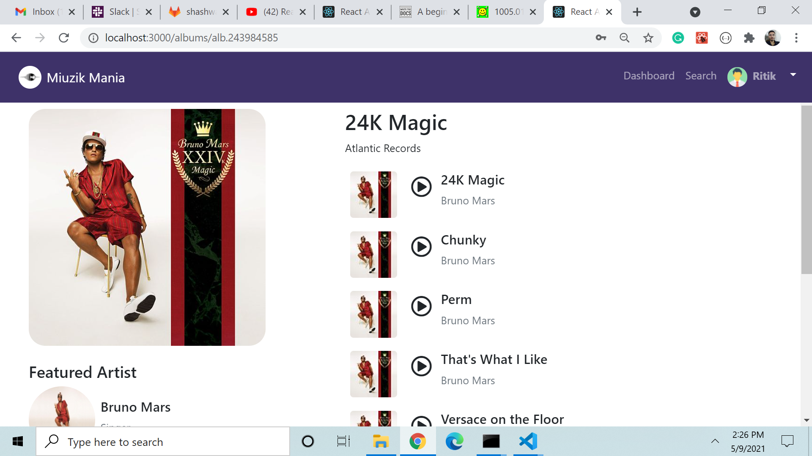
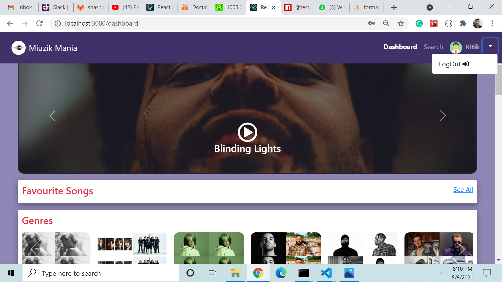

# PROJECT

Project is designed to cater the need of music lovers by providing one source to all kind of music to have all melodies and reduced efforts.

## Requirement Analysis

By performing requirement analysis we found that there is need to create an application which is able to display differnt varities of the songs by genres,artist,albums,track etc. in default page and upon signup/login user should be able to land into another page and play the song (previously also) add it favourites ,see the description of aritsts,albums etc. and if needed successfully logs out.

## Project Initiation

Project starts with creating working space at gitlab and dividing it into differnt branches and taking it into system.
In system we need to install differnt dependencies for better working of the project such as

> $ npm install

> $ npm install --save react-router-dom

> $ npm install @material-ui/core

> $ npm install @material-ui/icons

> $ npm install --save-dev
> @testing-library/react

> $ npm install @testing-library/jest-dom

> $ npm install --save-dev cypress

## Modules Used (upper level view)

Different Reactjs Component grouped together to form module to give logical view in order to comprehand the application in concise and meticulous way.

> Login/Signup -- This part helps user in Registering/signing in if he/she is not already.

> Home -- This is default Part when user access the website.

> Dashboard -- This is part user land upon logging in into the application and access the features.

> Favourite section -- In this part the songs which are frequently used and have been added by user is displayed

> Search -- This is the part where songs are searched by artists, albumbs, tracks and playlists.

> Header -- This is the part where all the links , buttons ,dropdowns are present to navigate among components.

## Components Used

Here is the list of components used to modularize the application

> - Album

> - AlbumDisplay

> - Artist

> - ArtistDisplay

> - controls

> - Dashbord

> - FavouriteSlider

> - Genre

> - GenreDisplay

> - Header

> - Home

> - Login

> - Modal

> - Register

> - Search

> - seeAllFavourites

> - SliderAlbum

> - SliderArtist

> - SliderGenre

> - SliderPlaylist

> - Spinner

 

## User Interface Design and View

- Home page -- The default or starting view of the application .   
  
   

- Register page -- This page is for signup of user's first access and storing the records.  
  
   

- Login page -- This is for authentication of user who are already Registered.  
  
   

- Dashboard page -- This is the landing page after the authentication part of user's details.  
  
   

- Search page -- This is the page user can search songs according to parameters(artists,albums,tracks,playlists)   
   

- Favourite page -- This is the page all the favourites songs are displayed for reference in future.   
   
   

- Profile section -- This is the part of application from where user can see profile of artist,albums etc in dashboad and related songs to that.   
   

- Logout section -- This is the part from where user can be logged out of dashboard and come to Home page.  
    

## User Guide

> ### Steps to be Followed

- open application in the localhost with given port number 5000 
- Firstly, There will be Home page on which information about Trending music , Trending pop , Albums and Trending country will be shown. 
- A new User has to Register himself/herself and then Login to reach to Dashboard section of app. 
- Dashboard there is option to search songs by artists,albums,tracks and playlists. 
- In Dashboard there is also option of Adding any song to Favourite by Clicking on heart icon . 
- Feature of Playing song is also there. 
- There is also option of Logging out is there onto Dashboard which navigates user to the Home page.
- Authentication Server is running of port no. 9000 by command - npm run server
- json server is running on port no 4000 by command -json-server db.json --watch -p 4000 .
    

> ## Testing
>
>  

> - Unit Testing has been performed using Jest testing tool.

> - Cypress's End to End Testing has been Performed to check readiness of the application.

 

## Technology and Tools Used

> For Development -- HTML,CSS,JAVASCRIPT AND REACTJS.

> For Testing -- JEST AND CYPRESS TOOLBOX.

   

Made By --

> Shashwat vats
